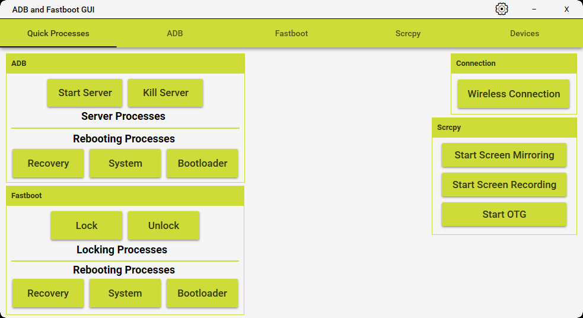

# 📱 ADB & Fastboot GUI

A highly modernized, ultra-responsive, and visually premium desktop application to manage Android devices using ADB (Android Debug Bridge) and Fastboot. 

No more command-line hassle! Manage your device safely, smoothly, and cleanly with a modern **MVVM (Model-View-ViewModel)** architecture and an asynchronous engine.

---

## 🧩 Core Features

### 🔹 ADB Mode (when device is booted)
- `Shell` – Send terminal commands directly to your device.
- `Reboot` – Reboot to system, bootloader, recovery, or fastbootd.
- `Apps` – Install, uninstall, or list installed applications.
- `Files` – Seamlessly push or pull files.
- `Start / Kill Server` – Control your local ADB server.
- `Get Device Info` - Read detailed manufacturer, serial number, and hardware info.
- `Screen Mirroring (Scrcpy)` - Mirror and control your device with customized codecs, audio, and recording.

### ⚡ Fastboot Mode (when device is in Fastboot)
- `Erase` - Wipe logical partitions.
- `Flash` – Flash images to partitions.
- `Reboot` – Reboot back to system.
- `Sideload` – Sideload official OTA updates from recovery.
- `Logical Partition Management` – Safely create, erase, or resize partitions (secured with warning dialogs).


## 🔄 Refreshing Device List (F5 Key)

If your device doesn’t show up immediately after plugging it in:
> 📌 Just press **F5** to automatically rescan and update the ADB/Fastboot device list in real-time.

---

## 🛠 Requirements

- USB Debugging must be enabled on your Android device.
- Google OEM USB drivers must be installed on your PC.
- Supported OS: **Windows** (.NET Framework 4.8).

---

## 🔨 How to Build / Compile

Since this is a classic **.NET Framework 4.8 WPF** project, it must be compiled using **MSBuild** from Visual Studio (modern `dotnet build` from the newer .NET Core/5/6/7/8/9 SDK has gaps with legacy XAML compiling).

### 1. Clone the repository:
```bash
git clone https://github.com/yourusername/ADBFastbootGUI.git
cd ADBFastbootGUI/src
```

### 2. Restore NuGet Packages:
Open the solution in Visual Studio to let NuGet restore packages automatically, or run:
```bash
nuget restore ADBFastbootGUI.sln
```

### 3. Build the Solution:
- **Option A (Visual Studio)**: Open `ADBFastbootGUI.sln` in **Visual Studio 2022** and click **Build > Build Solution**.
- **Option B (Command Line)**: Use Visual Studio's MSBuild in PowerShell:
  ```powershell
  # Adjust the path below to match your Visual Studio version/edition (Community/Professional/Enterprise)
  & "C:\Program Files\Microsoft Visual Studio\2022\Community\MSBuild\Current\Bin\MSBuild.exe" .\ADBFastbootGUI\ADBFastbootGUI.csproj
  ```

---

## 📷 Screenshot

> 

---

## 📄 License

This project is licensed under the MIT License - see the [LICENSE](LICENSE) file for details.

---

## 💬 Contributing & Support
Feel free to open issues, submit pull requests, or share your feedback! 
If you find this project helpful, please consider leaving a ⭐ or [Supporting the Project](https://buymeacoffee.com/duranforreal).
